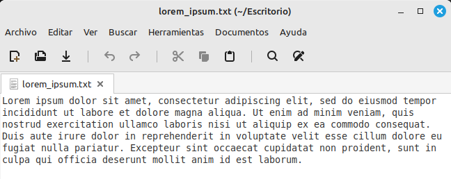
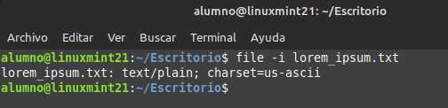
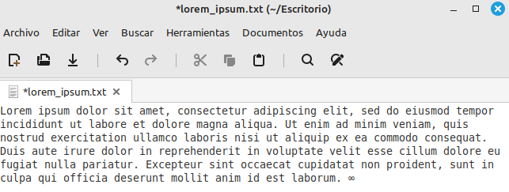
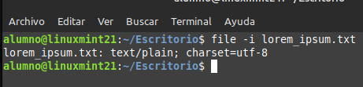

# Ejercicio 6
## Crea un fichero de texto llamado lorem_ipsum.txt en Linux.

 

## Comprueba la codificación del fichero mediante la terminal de Linux

 

## Modifica el fichero y añade algún caracter que no se encuentre en el código ASCII y vuelve a comprobar la codificación del fichero.

 

## ¿Qué ha pasado?

Se ha cambiado charset a utf-8

 