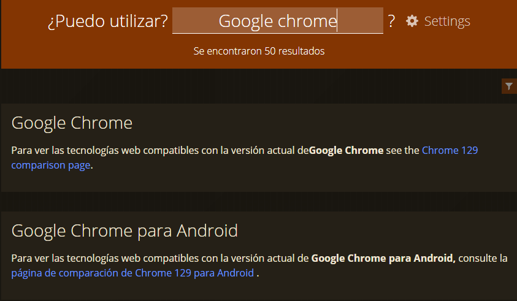

# HTML 5.1 y HTML 5.2

Los estándares HTML 5.1 y HTML 5.2 introducen etiquetas HTML nuevas. Busca dos o tres etiquetas HTML de cada estándar HTML 5.1 y 5.2

## HTML 5.1
* ```<dialog>:``` Representa un cuadro de diálogo o un panel que puede ser modal o no modal, utilizado para interacciones con el usuario.
* ```<template>:``` Define un contenido que no se renderiza inmediatamente, sino que puede ser utilizado en scripts para crear instancias dinámicas.
* ```<picture>:``` Permite la carga de imágenes en diferentes formatos y tamaños, mejorando la adaptabilidad a distintos dispositivos y resoluciones.

## HTML 5.2
* ```<details>:``` Proporciona una manera de mostrar información adicional que el usuario puede mostrar u ocultar mediante un clic.
* ```<summary>:``` Se utiliza dentro de ```<details>``` para definir un resumen que será visible cuando el contenido esté oculto.
* ```<menuitem>:``` Representa un elemento de un menú que puede ser utilizado para crear menús contextuales o de navegación.

Comprueba si tu versión de navegador Google Chrome las soporta. Para comprobar si tu versión del navegador soporta las etiquetas HTML usa la siguiente URL:

[Comprobación](https://caniuse.com/)

 